# SolarHive
## AI-Powered Community Solar Energy Intelligence

> **The Gemma 4 Good Hackathon** — Google DeepMind x Kaggle
> **Track:** Global Resilience
> **Special Technology Tracks:** Ollama, Unsloth

[](https://kaggle.com/competitions/gemma-4-good-hackathon)
[](https://kaggle.com/models/google/gemma-4)
[](https://huggingface.co/spaces/Truthseeker87/solarhive)
[](https://ollama.com/library/gemma4)
[](https://unsloth.ai)
[](LICENSE)

---

## The Dream

> *Each household in any given community is a potential energy producer
> and consumer — making it a potential clean energy island.*
>
> *Community-based storage such as fuel cells (e.g., solid oxide fuel
> cells or salt-based fuel cells) will help capture excess energy in
> each community of households to compensate for low production
> efficiency of solar.*
>
> *Energy can be distributed across communities based on energy needs
> in a decentralized live or hybrid grid — as opposed to a dead grid.*

**SolarHive is an open-source intelligence layer designed to coordinate
community microgrids & community-based storage via fuel cells, pool
midday energy surplus across these microgrids, and eliminate stranded
capacity. It also helps forecast solar irradiance and cloud cover to
plan ahead.**

Powered by Gemma 4, it transforms fragmented household-level solar data
into a unified, conversational, visual community energy picture —
helping suburban neighborhoods collectively optimize their distributed
solar generation and shared battery storage.

---

## Why This Matters to Me

I chose Ann Arbor, Michigan as SolarHive's prototype location because I live here — after years in New York and Boston. Ann Arbor's low-lying suburban landscape eliminates the shading complications of high-rise cities, making it an ideal testbed for community solar.

My motivation runs deeper than a hackathon:

**The dream of household energy production.** Every home in a community is a potential energy producer and consumer — a clean energy island. Community-based storage using batteries and fuel cells (solid oxide or salt-based) can capture surplus energy to compensate for solar's low production efficiency. This dream was sparked during my undergraduate years at the National University of Singapore, where electives in green energy, atmospheric chemistry, and evolutionary biology taught me the deep connection between photosynthesis, carbon sequestration, and Earth's climate systems.

**Live grids for critical infrastructure.** Decentralized energy generation can supplement existing grids for burstable demands — hospitals, AI-optimized data centers, telecommunications networks, traffic systems, and solar-powered seawater desalination plants like the one announced in Yeosu, South Korea.

**The unsolved side of the energy equation.** In 2024, I visited Schneider Electric's headquarters in Paris to learn from chief executives including former Group CFO Hilary Maxson. While strong private-sector players like Schneider have solved many problems in energy *distribution*, the other side of the equation — energy *production* and source diversity — remains a global challenge. That visit refocused my research on production.

**Singapore's example.** My home country continues to invest actively in energy production diversification, providing real-world case studies for household energy generation and community storage.

**A personal stake in the future.** My wife and I are expecting our firstborn — a girl we are naming Gemma. The coincidence with Google's model name is not lost on me. I need to play my part, however small, to help pave the way for future generations rather than leave our problems to them.

---

## The Problem: Why Solar Production Efficiency Is Low

Solar energy and photovoltaic cells have low production efficiency due
to a cascade of factors that compound at every stage from sunlight to
usable electricity.

### Environmental & Locational Factors

**Location, climate, and seasonality:** Communities and households in
different locations experience varying amounts of sunlight. Spring,
summer, fall, and winter each produce dramatically different solar
irradiance profiles. Michigan receives roughly 1,400 kWh/m²/year
versus 2,000+ kWh/m²/year in Colorado — a 30% gap from geography alone.

**Changes in cloud cover:** Atmospheric conditions including clouds,
aerosols, and pollutants can reduce electricity output by up to 60%.
Cloud intermittency causes sudden production drops that are particularly
wasteful without local storage.

**Dust, dirt, and debris:** Soiling from dust, pollen, and bird
droppings reduces light absorption and can cut panel efficiency by
5–30%. In extreme cases, debris creates hot spots that permanently
damage cells.

### Physics & Material Losses

**Electron losses across silicon layers:** As electrons travel across
the anodes, cathodes, and silicon layers of photovoltaic cells, energy
is lost to resistive and recombination effects. These charge carrier
collection losses and conduction losses are inherent to the
semiconductor physics of solar cells.

**Silicon type matters:** The use of amorphous or polycrystalline
silicon (as opposed to monocrystalline) significantly reduces
efficiency. Amorphous silicon panels achieve only 6–10% efficiency
versus 20–25% for monocrystalline. Polycrystalline falls in between
at 15–17%. The crystal structure directly affects how freely electrons
can move.

**Temperature and thermal losses:** Panel efficiency drops 0.4–0.5%
per degree Celsius above 25°C. A hot summer day at 40°C can reduce
output by 6–7.5% from thermal effects alone.

**Optical reflection losses:** Light bouncing off the panel surface
rather than being absorbed. Anti-reflective coatings help but cannot
eliminate this entirely.

**Spectral mismatch:** Solar cells can only convert certain wavelengths
of sunlight. Energy outside the cell's absorption band is wasted as
heat, bounded by the Shockley–Queisser theoretical limit of ~33% for
single-junction cells.

### System-Level Losses

**Inverter conversion losses:** Converting DC to AC power costs 3–5%
efficiency through the inverter.

**Panel degradation over time:** Monocrystalline panels lose 0.3–0.5%
efficiency per year, accumulating ~8% loss over 20 years.

**Shading and partial obstruction:** Trees, buildings, or even one
panel's shadow on another can disproportionately reduce output for an
entire string of panels.

**Wiring and connection losses:** DC cable losses occur whenever
current flows. Bypass diode losses, mismatch between panels, and
junction box resistance all compound.

### The Compounding Problem

These losses compound. A community in Ann Arbor with polycrystalline
panels on a partly cloudy 85°F day with moderate dust might see:

```
70% location factor
× 60% cloud factor
× 95% thermal efficiency
× 95% soiling factor
× 95% inverter efficiency
─────────────────────────────
≈ 34% of rated capacity reaching the household as usable electricity
```

This is why community-level intelligence and shared storage are not
luxuries — they are necessities for making solar viable.

---

## The Solution

SolarHive addresses the compounding efficiency problem at the community
level through three mechanisms:

**Collective intelligence:** Each household is both a producer and
consumer. SolarHive's AI layer sees the whole community's energy state
— who's overproducing, who's underproducing, where storage capacity
exists — and optimizes the collective rather than each home in
isolation.

**Community-based storage:** Shared battery storage (and eventually
fuel cell technologies like solid oxide or salt-based fuel cells)
captures surplus energy that would otherwise be exported at low grid
rates. This compensates for low production efficiency by ensuring no
generated watt is wasted.

**Decentralized live grid:** Energy flows within the community based on
real-time need — a live, breathing grid rather than the dead,
one-directional grid of traditional utility infrastructure. SolarHive
is the brain that orchestrates these flows.

> *SolarHive doesn't change the physics of solar panels.
> It changes how communities USE what those panels produce —
> and that changes everything.*

---

## How Gemma 4 Powers SolarHive

SolarHive leverages three core Gemma 4 capabilities, directly aligned
with what the hackathon demands: **multimodal power**, **native
function calling**, and **domain-adapted fine-tuning**.

---

### Feature 1 — Multimodal VQA (Three Modes)

#### VQA Mode 1 — Sky Condition Analysis *(Primary Demo Moment)*

A community member photographs the sky. The user asks:
*"How will this affect our solar production?"*

Gemma 4 analyzes cloud formations, estimates coverage percentage,
combines this with live weather API data via function calling, checks
community battery state, and responds with a grounded, actionable
forecast — multimodal vision and native tool calling working together
in a single agentic turn.

> *"The image shows heavy, uniform overcast conditions with thick gray
> cloud cover obscuring the sun completely. This type of overcast sky
> typically reduces solar production to 10-25% of clear-sky capacity.
> At this moment, expect roughly 10-25 kW community output from your
> 72 kW array. This is a good time to conserve battery for evening
> peak hours and defer non-essential loads."*

#### VQA Mode 2 — Panel Health Inspection

A homeowner photographs their rooftop panels. Gemma 4 visually
identifies dirt and debris buildup, shading from trees, physical
damage, or suboptimal tilt. It cross-references visual findings with
that home's production data to quantify the efficiency impact.

> *"I can see significant dust on your panels. Your production has been
> 15% below the neighborhood average, which is consistent with what
> I'm seeing."*

#### VQA Mode 3 — Neighborhood Aerial Assessment

Upload a satellite or aerial image of the neighborhood. Gemma 4
identifies which roofs have panels, estimates orientation and potential
capacity, and spots shading issues. Useful for community planning.

> *"Three homes on Oak Street have south-facing roofs with no panels —
> they'd add an estimated 12kW to the community grid."*

---

### Feature 2 — Native Function Calling (Agentic)

SolarHive uses Gemma 4's native tool-use protocol — **not
prompt-engineered function calling.** This is a critical distinction.

Tools are passed via `apply_chat_template(tools=[...])` and the model
autonomously decides which tools to invoke using Gemma 4's dedicated
control tokens (`<|tool_call>` and `<|tool_response>`).

**Five tools Gemma 4 can invoke autonomously — all three keyed APIs (OWM, EIA, NREL) actively wired:**

| Tool | API | Returns |
|------|-----|---------|
| `get_weather(location)` | OpenWeatherMap (`OWM_API_KEY`) | Temperature, clouds %, wind, humidity, sunrise/sunset |
| `get_solar_production(clouds_pct, temp_f)` | Open-Meteo GHI (keyless) | Production kW, efficiency %, GHI W/m², temp derating |
| `get_battery_state()` | Community BMS (simulator) | State of charge, capacity, charging status |
| `get_grid_status()` | EIA Open Data (`EIA_API_KEY`) | Pricing period, rate/kWh, renewable %, CO2 intensity |
| `get_nrel_pvwatts_baseline()` | NREL PVWatts v8 (`NREL_API_KEY`) | Annual + current-month typical kWh + avg kW for the 72 kW array |

**The four-stage agentic loop:**

```
Stage 1 — Tool Definition
  Five tools passed to Gemma 4 via apply_chat_template(tools=[...])
  with typed Python signatures and Google-style docstrings.
  Gemma 4's chat template automatically generates the tool schema.
          ↓
Stage 2 — Model Decides
  Gemma 4 analyzes the question, reasons about which data it needs,
  and emits structured tool_call tokens requesting specific tools.
          ↓
Stage 3 — Developer Executes
  Code intercepts each tool_call via regex parsing (call:fn_name{args}),
  executes the real API request (OpenWeatherMap, Open-Meteo, EIA, NREL
  PVWatts), and feeds results back as a TWO-message sequence:
      {"role": "assistant", "tool_calls": [{"function": {...}}, ...]}
      {"role": "tool", "name": "<fn>", "content": "<JSON string>"}
  Loops up to 3 rounds. This 2-message format is byte-identical to what
  solarhive_datagen.py emits and solarhive_finetune.py trains on, so the
  inference path matches the training distribution exactly.
          ↓
Stage 4 — Model Responds
  Gemma 4 reads the tool results and synthesizes a final,
  grounded recommendation based on actual live data.
```

> **Training/inference alignment:** the 2-message `{role:assistant, tool_calls:...}` + `{role:tool, name, content}` format is shared across `solarhive_datagen.py` (training-data generation), `solarhive_finetune.py` (SFT preprocessing + schema validation), `solarhive_inference.py` Cell 4 `generate_with_tools()` (transformers agentic loop), `solarhive_inference.py` §13g (Ollama agentic loop), and `solarhive_inference_e4b_gguf_ollama.py` `_build_gemma4_prompt()` (local GGUF deployment). This differs from Google's vanilla function-calling docs (which use a single message with `tool_calls` + `tool_responses` keys) — we use the 2-message form because that's what the model was fine-tuned on; switching would mismatch the training distribution.

**Why this matters — selective tool reasoning:**

```
"What time does peak pricing start?"
→ Model calls: get_grid_status() only

"Is today's production above typical for January?"
→ Model calls: get_solar_production() + get_nrel_pvwatts_baseline()

"Should I run my pool heater now?"
→ Model calls: get_weather() + get_solar_production()
               + get_battery_state() + get_grid_status()
```

The model decides which tools are relevant based on the question —
not blindly fetching everything. This demonstrates genuine agentic
reasoning.

**Inference-time When2Call validation (`solarhive_inference.py` §11b — `WHEN2CALL_PROBES`).**
Three held-out probes added  validate
coverage of 3 of the 4 failure-mode categories from
[Ross, H., Mahabaleshwarkar, A. S., & Suhara, Y. (2025).
*When2Call: When (not) to Call Tools.* arXiv:2504.18851](https://arxiv.org/abs/2504.18851).
The paper documents 9–67% tool-hallucination rates in untrained
community models on the (c) and (d) categories below — failure modes
public tool-calling datasets often miss because they lack follow-up
and unable-to-answer examples.

| Category | Probe                                              | Expected behavior                                                |
|---------:|----------------------------------------------------|------------------------------------------------------------------|
| **(b)**  | "What's the current grid rate?"                    | Correct tool call (`get_grid_status`) — well-specified, in-scope |
| **(c)**  | "How much will a 10 kW array produce today?"       | Follow-up question (asks for location) — does NOT auto-fill Ann Arbor |
| **(d)**  | "What's the current air quality index in Ann Arbor?" | Polite refusal + redirect (e.g., airnow.gov) — does NOT hallucinate an `get_aqi` tool |

A baseline community model trained without these categories typically fails (c) + (d) by hallucinating
tools or auto-filling defaults (per the paper's 9-67% rate). With the
`_UNABLE_TO_ANSWER` + `_FOLLOW_UP_QUESTIONS` corpus categories from
[`solarhive_datagen.py`](https://huggingface.co/datasets/Truthseeker87/solarhive-community-solar-multimodal)
included in training: A4B family scores 3/3, E4B family scores 2/3, with zero regression on the cloud
8/8 parity baseline. Full per-variant breakdown in the Multi-Variant Deployment Validation section above.

**Example grounded response:**

> *"Battery is at 72%, partly cloudy with 55% production. You have
> headroom — run it now before peak pricing starts at 4pm."*

**VQA + Function Calling in one agentic turn:**

When the user uploads a sky photo alongside their question, Gemma 4
processes the image via its vision encoder, reasons about both the
visual input and the question, then decides which tools to call. This
is multimodal and native function calling working together in a single
agentic turn — the exact pattern the hackathon emphasizes.

```python
# One call: image analysis + live API tool calling + grounded response
result = solarhive_agent(
    question="How will this sky affect our production? Should I charge my EV now?",
    image=sky_photo   # Gemma 4 processes image AND calls tools in one turn
)
# → tool_calls: [get_weather, get_solar_production, get_battery_state, get_grid_status, get_nrel_pvwatts_baseline]
# → response: grounded answer citing both visual observation and live API data
```

---

### Feature 3 — Dual Fine-Tuned Domain Expert (Unsloth + Ollama)

**Why these models?** Gemma 4 offers four model sizes. We evaluated all
four and selected two complementary architectures for a dual fine-tune
strategy — one for cloud inference, one for edge deployment:

| Model | Params (Total / Active) | Architecture | Vision Encoder | Context | Modalities | Selection |
|-------|------------------------|--------------|---------------|---------|------------|-----------|
| E2B | 5.1B / 2.3B effective | Dense + PLE | ~150M | 128K | Text, Image, Audio, Video | **Ollama serving target** — lightest, runs on laptop CPU, 34 quantized variants |
| E4B | 8B / 4.5B effective | Dense + PLE | ~150M | 128K | Text, Image, Audio, Video | **Fine-tuned for edge** — Any-to-Any multimodal, fits T4 in 4-bit (~12 GB) |
| 26B A4B | 25.2B / 3.8B active | MoE (8/128) | ~550M | 256K | Text, Image | **Fine-tuned for cloud** — best domain absorption (0.6956 loss), 256K context |
| 31B | 30.7B / 30.7B | Dense | ~550M | 256K | Text, Image | **Rejected** — only 2–3% better than 26B A4B, 2–4x slower, tighter GPU fit |

*Source: [Gemma 4 Model Card](https://ai.google.dev/gemma/docs/core/model_card_4). All four models support native function calling and agentic workflows.*

**Benchmark backing — why 26B A4B is the sweet spot:**

SolarHive requires two core capabilities: **multimodal VQA** (analyzing
sky photos and panel images to assess solar conditions) and **native
function calling** (autonomously invoking weather, solar, battery, and
grid APIs in agentic loops). The official benchmarks show why 26B A4B
delivers the best capability-to-cost ratio for these use cases:

| Benchmark | SolarHive Use Case | E2B | E4B | **26B A4B** | 31B |
|-----------|-------------------|-----|-----|-------------|-----|
| MMMU Pro (vision) | Sky/panel VQA analysis | 44.2% | 52.6% | **73.8%** | 76.9% |
| MATH-Vision | Visual reasoning on solar data | 52.4% | 59.5% | **82.4%** | 85.6% |
| OmniDocBench (↓better) | Document understanding | 0.290 | 0.181 | **0.149** | 0.131 |
| MMLU Pro | Domain expertise (energy advisory) | 60.0% | 69.4% | **82.6%** | 85.2% |
| GPQA Diamond | Scientific reasoning | 43.4% | 58.6% | **82.3%** | 84.3% |
| MRCR v2 128K | Multi-round tool-calling context | 19.1% | 25.4% | **44.1%** | 66.4% |
| CoVoST (audio) | Future voice interaction | 33.47 | 35.54 | — | — |

The pattern is clear: **26B A4B captures ~95% of 31B's quality** on
vision (MMMU Pro 73.8% vs 76.9%) and reasoning (MMLU Pro 82.6% vs
85.2%), while being significantly more efficient via MoE sparse
activation. Meanwhile, E4B/E2B retain audio capabilities that 26B A4B
and 31B lack entirely — making them the right choice for edge
deployment with future voice interaction.

**Key architectural decisions:**

- **26B A4B for cloud inference (VQA + function calling):** The larger
  ~550M vision encoder delivers superior sky condition analysis and
  panel health inspection — critical for SolarHive's three VQA modes
  (MMMU Pro 73.8% vs E4B's 52.6%). MoE sparse activation (only 3.8B
  of 25.2B params active per forward pass) achieves near-31B quality
  at a fraction of the compute. 256K context window accommodates
  multi-round agentic tool-calling loops where the model chains 4 API
  calls per turn. Absorbs domain knowledge most effectively (converged
  loss 0.6956 vs E4B's 0.9218). Fits A100-40GB in NF4 (~16 GB) or runs
  BF16 on 96 GB GPUs.

- **E4B for fine-tuning (edge path):** Compact dense model with
  Per-Layer Embeddings (PLE) for memory efficiency. Supports
  image + audio + text (Any-to-Any) — enabling future voice interaction
  for community members querying energy status from mobile devices
  (CoVoST 35.54 — unavailable on 26B A4B/31B). All Gemma 4 models
  share the same native function-calling protocol, so E4B retains full
  tool-use capability at the edge. Trains in just 420s on RTX PRO 6000.
  LoRA adapters merge to safetensors for Ollama.

- **E2B for Ollama serving (not E4B):** At 2.3B effective parameters,
  E2B runs on laptop CPU without a GPU — the strongest local-first,
  privacy-first narrative. Community energy data never leaves the
  neighborhood. Retains VQA, function-calling, and audio capabilities
  (CoVoST 33.47) for basic sky assessment and tool invocation at the
  edge.

- **31B rejected:** The fully dense 30.7B model scores only 2–3% higher
  than 26B A4B on vision (MMMU Pro 76.9% vs 73.8%) and reasoning (MMLU
  Pro 85.2% vs 82.6%) but requires 2–4x more compute and VRAM. The
  shared ~550M vision encoder means VQA quality is comparable — the
  marginal gain does not justify the cost for a community energy
  advisor.

Two models fine-tuned via Unsloth LoRA on the canonical SolarHive
training corpus, targeting both cloud and edge deployment:

| Model | Role | Training | Export |
|-------|------|----------|--------|
| Gemma 4 26B A4B (MoE) | Cloud inference + VQA demo | LoRA r=16, BF16, 7,198s | LoRA adapters |
| Gemma 4 E4B (8B) | Edge deployment via Ollama | LoRA r=16, BF16, 420s | LoRA → Ollama |

**Training data:** [`solarhive-community-solar-multimodal`](https://huggingface.co/datasets/Truthseeker87/solarhive-community-solar-multimodal) — **1,727 rows** (1,713 text + 14 image-grounded), ~347K tokens. Composition:

- **413 hand-crafted Q&A** spanning 15+ US cities and 9 energy domains
  (sky conditions, battery management, panel health, consumption
  optimization, community/grid strategy, emergency resilience, seasonal
  planning, multi-step reasoning, alternative storage)
- **~1,117 API-grounded Q&A** generated from live Open-Meteo (GHI/DNI/DHI,
  low/mid/high cloud cover), NREL PVWatts v8, OpenWeatherMap, and EIA
  Open Data v2 — joined on `(location, hourly timestamp)` so each
  multi-source example carries co-occurring grounding for Ann Arbor, MI
  and San Mateo, CA
- **183 tool-calling examples** following the [When2Call](https://arxiv.org/abs/2504.18851)
  taxonomy — 106 *should-call*, 53 *should-not-call*, 10 *unable-to-answer*,
  6 *follow-up clarification*, 8 failure-recovery — so the model learns
  when to call tools, when to refuse politely, when to admit a tool
  can't answer, and when to ask a clarifying question
- **14 image-grounded Q&A turns** from 7 manually-labeled Ann Arbor sky
  photographs (cloud type + percentage cloud cover, expected production
  traced via the same temperature-derated GHI formula used elsewhere)

Every numeric claim in an algorithmic answer traces to a real API
response — no LLM-generated numbers.

**Shared hyperparameters:** LoRA rank=16, alpha=16, dropout=0,
target=all-linear, lr=2e-4, optimizer=adamw_8bit, warmup=5 steps,
max_seq_len=2048, precision=BF16, seed=3407. Batch size auto-tuned
by free GPU VRAM at runtime.

**Training results (Google Colab G4 VM, RTX PRO 6000, BF16):**

| Model | Converged Loss | Trainable Params | Initial 8-Q Benchmark | May 2026 Final Run | Time |
|-------|---------------|-----------------|-----------------------|-------------------|------|
| Gemma 4 26B A4B | **0.6956** | 505.4M / 26.3B (1.92%) | **8/8** (5/5 Q&A, 3/3 tool) | **9/10 + 3/3 W2C** (multi-variant 10-Q parity benchmark) | 7,198s |
| Gemma 4 E4B | **0.9218** | 41.2M / 8.0B (0.51%) | **8/8** (5/5 Q&A, 3/3 tool) | **10/10 + 2/3 W2C** (LoRA + base, sole 10/10 winner) | 420s |

**Fine-tuning is text-only on the multimodal-capable corpus** — image
rows in the dataset are skipped at the data-prep layer. VQA at
inference time uses the base Gemma 4 model's pretrained vision encoder
(~150M params for E4B, ~550M for 26B A4B per the [official model
card](https://ai.google.dev/gemma/docs/core/model_card_4)), which is
not modified by our LoRA. This matches the Vertex AI Gemma 4 SFT
recipe documented in the [Hugging Face blog](https://huggingface.co/blog/gemma4),
which explicitly freezes both vision and audio towers during
text-focused fine-tuning.

*Isolated benchmarks run without tool schemas. Production benchmarks
run in the full agentic loop with tool definitions passed via
`apply_chat_template(tools=[...])`. The 26B A4B reliably calls tools
when given the function signatures it was trained on.*

**Precision pipeline — BF16 is Gemma 4's native release format.** Google
publishes the open-source [Gemma 4 base](https://huggingface.co/google/gemma-4-26b-a4b-it)
in BF16; there is no FP32 release to begin with. Our LoRA fine-tuning
runs at BF16 over that BF16 base, and Unsloth's `save_pretrained_merged(method="merged_16bit")`
folds the LoRA delta into the base weights at the same BF16 precision.
The NF4 step is therefore the **only** quantization in the entire
SolarHive 26B A4B pipeline:

```
Google's open-source Gemma 4 26B A4B base (BF16, native release precision)
  ↓ LoRA fine-tuning at BF16
solarhive-26b-a4b-lora (BF16 adapter delta, ~2 GB)
  ↓ merge_16bit
solarhive-26b-a4b-merged (BF16 full weights, ~48 GB — same precision as base)
  ↓ BitsAndBytesConfig(load_in_4bit=True, nf4)  ← only quantization step
solarhive-26b-a4b-nf4 (partial NF4 + BF16 hybrid, ~48 GB)
```

**Quantization quality preserved at deployment.** The 26B A4B was
re-merged from the published LoRA + base model and NF4-quantized via
`BitsAndBytesConfig` for HF Spaces deployment. The NF4 quantized
variant ([`solarhive-26b-a4b-nf4`](https://huggingface.co/Truthseeker87/solarhive-26b-a4b-nf4))
scores **8/8** on the same 5 Q&A + 3 tool-calling held-out set —
matching the BF16 merged baseline exactly. The six model repos
(`solarhive-26b-a4b-{lora,merged,nf4}`,
`solarhive-e4b-{lora,ollama,gguf}`) all carry consistent v2 weights and
v2-aligned model cards. The `-e4b-lora` repo was added separately to
expose the E4B LoRA delta as a standalone artifact (it had previously
only existed as a Drive backup; the merge → safetensors push from the
fine-tuning notebook was the only HF artifact for the E4B family until
that step). It bootstraps the `solarhive_merge_e4b.ipynb` recipe so
that notebook is now runnable on a fresh Colab session.

### Edge GGUF deployment — both Q4_K_M variants score 10/10 on a 16 GB laptop

The fine-tuned E4B was quantized to two interchangeable Q4_K_M GGUF variants for Ollama / llama.cpp edge deployment. Both were inferenced on the **same** 16 GB Intel i5-1135G7 laptop CPU via Ollama 0.21.0 — confirming quantization-precision independence at the edge-inference target.

| | PLE-Q4_0 (laptop quant) | Standard Q6_K-PLE (cloud quant) |
|---|---|---|
| GGUF size | **4.61 GB** | **5.34 GB** |
| Quantization hardware | 16 GB laptop (`--tensor-type` PLE override) | High-RAM cloud notebook (llama.cpp default Q4_K_M) |
| Inference hardware | 16 GB Intel i5 laptop CPU (same) | 16 GB Intel i5 laptop CPU (same) |
| Domain Q&A (5 prompts) | **5/5 ✅** | **5/5 ✅** |
| Tool calling (5 prompts) | **5/5 ✅** | **5/5 ✅** |
| **Total benchmark** | **10/10** | **10/10** |
| HF artifact | [`solarhive-e4b-gguf`](https://huggingface.co/Truthseeker87/solarhive-e4b-gguf) → `solarhive-e4b-q4_k_m.gguf` | [`solarhive-e4b-gguf`](https://huggingface.co/Truthseeker87/solarhive-e4b-gguf) → `solarhive-e4b-q4_k_m-standard.gguf` |

Both pair with the same 992 MB [`mmproj-solarhive-e4b-BF16.gguf`](https://huggingface.co/Truthseeker87/solarhive-e4b-gguf) (vision SigLIP + audio Conformer, 1411 tensors) for full multimodal via `llama-server --mmproj`. The demo path uses Ollama's **`/api/generate` raw mode + a manual Gemma 4 prompt builder** — it bypasses Ollama 0.21.0's `gemma4.go` content-drop issue (which silently rejects fine-tuned Gemma 4's native tool-call format) to score 10/10 + 2/3 W2C. See `solarhive_inference_e4b_gguf_ollama.py` for the implementation.

### Three-tier hardware deployment — one fine-tuning pipeline, four runtime targets

The same fine-tuned SolarHive model family serves four distinct hardware classes. Each tier is operationally validated (✅) or planned (🔜):

| Tier | Hardware | Cost | Power | Runtime | Model variant | Track | Status |
|------|----------|------|-------|---------|---------------|-------|--------|
| **Phone** | Any Android / iOS / browser | $0 (existing phone) | phone battery | LiteRT / MediaPipe Tasks Web | E2B `.tflite` | LiteRT | 🔜 planned (see the LiteRT browser deployment plan) |
| **Community microgrid hub** | [Jetson Orin Nano Super Developer Kit](https://www.nvidia.com/en-us/autonomous-machines/embedded-systems/jetson-orin/nano-super-developer-kit/) | **$249** | **7–25 W** (solar-powerable) | [llama.cpp + CUDA](https://huggingface.co/blog/nvidia/gemma4) | E4B Q4_K_M + mmproj (5.3 GB total) | llama.cpp | ✅ GGUF directly deployable today |
| **Admin / operator laptop** | Intel i5-1135G7 (any 16 GB CPU laptop) | existing hardware | CPU-only | Ollama (llama.cpp backend) | E4B Q4_K_M | Ollama + llama.cpp | ✅ 10/10 parity benchmark proven |
| **Cloud** | HF Space / Colab | — | — | transformers + Unsloth `FastVisionModel` | 26B A4B LoRA (BF16 or NF4) | Unsloth | ✅ Live demo + 8/8 agentic benchmark |

One fine-tuning pipeline (Unsloth), one training dataset (1,727-row canonical corpus), one chat template, four hardware classes, four Special Tech tracks (LiteRT, llama.cpp, Ollama, Unsloth) — the deployment target is the only variable.

**Why the Jetson Orin Nano Super matters:** at 7–25 W on a $249 board, a single Jetson can run 24/7 from a modest solar-plus-battery setup — the SolarHive intelligence runs on the same energy infrastructure it advises. Mobile clients on the local network hit the hub at `http://<hub-ip>:8080` for tool-calling responses with live API data. Nvidia's [official Gemma 4 Jetson recipe](https://huggingface.co/blog/nvidia/gemma4) uses our exact llama.cpp stack; our `solarhive-e4b-q4_k_m.gguf` (4.61 GB) drops in directly with only the CUDA build flag change (`-DGGML_CUDA=ON`, `-DCMAKE_CUDA_ARCHITECTURES="87"`).

**Local-first, privacy-first:** Running Gemma 4 via Ollama, llama.cpp, or LiteRT keeps community energy data inside the neighborhood. No cloud dependency, no latency penalty, no privacy concerns — the AI runs where the community lives.

### On-device reasoning pattern — deterministic workflow + E2B LiteRT

For the Phone / browser tier specifically, the recommended pattern is to couple the on-device E2B LiteRT model with a **deterministic workflow that pulls live data on the device or at a local endpoint, then injects the fetched values into the E2B prompt as grounded context.** E2B reasons over the context and emits the compact emoji response; it does not orchestrate API calls directly.

```
1. User taps "Run dishwasher?"
2. Device workflow fetches weather / GHI / battery / grid rates
   (native API calls, local sensor reads, or a server-side proxy)
3. Context is inlined into the E2B prompt:
     "Context: ☀️ clear, 820 W/m² GHI, 🔋 78%, 🟢 off-peak $0.08/kWh.
      User: Run dishwasher?"
4. E2B (LiteRT / MediaPipe Web / litert-lm) emits:
     "☀️🟢 Run now, peak solar plus off-peak grid."
5. UI renders leading emojis large + text underneath.
```

**Why this beats on-device tool calling at the ultra-edge tier:** smaller models degrade on structured tool-call output; client-side tool calling exposes API keys in page source; the emoji system prompt conflicts with a tool-calling system prompt. The deterministic workflow handles orchestration as plain code and hands E2B a single well-scoped reasoning task. The pattern works identically on native mobile (Swift / Kotlin / Flutter), browser (MediaPipe LLM Inference Web + WebGPU), and Raspberry Pi 5 (`litert-lm` Python), and degrades gracefully to cached values when APIs are unreachable.

See [solarhive-e2b-merged](https://huggingface.co/Truthseeker87/solarhive-e2b-merged) (once published) for the full deployment recipe and the `solarhive_e2b_liteRT_finetune.ipynb` notebook for the fine-tune pipeline.

---

## Architecture

```
Three Colab Notebooks — the complete pipeline:

solarhive_datagen.py     Data generation: 4 live APIs → 551 training examples
        ↓                + 14 diagnostic charts
solarhive_finetune.py    Dual LoRA fine-tuning via Unsloth
        ↓                E4B (420s) + 26B A4B (7,198s)
solarhive_inference.py   Live demo: fine-tuned 26B A4B + 4 API tools
                         + 3 VQA modes + agentic loop + benchmarks

Hardware: Google Colab G4 VM — NVIDIA RTX PRO 6000 Blackwell
          Server Edition (96 GB GDDR7), BF16 precision
Platform: Google Colab Pro
```

**Agentic loop (Cell 4):**
1. System prompt repeated twice — improves instruction following in causal
   LLMs ([Leviathan et al., 2024, Google Research](https://arxiv.org/abs/2512.14982))
2. Tools defined as Python functions with typed signatures → auto-schema
3. Two-step tokenization (critical for transformers 5.5.x compatibility)
4. Model emits `call:fn_name{args}` → parsed via regex
5. Real APIs execute, results fed back as tool messages
6. Loop up to 3 rounds → final grounded response

**LoRA loading (Cell 2b):**
Fine-tuned adapters loaded via Unsloth's `FastVisionModel` — standard
PEFT cannot handle Gemma 4's `Gemma4ClippableLinear` and MoE expert
layers.

---

## Live Demo Output (April 15, 2026 capture)

Five interactive queries against the fine-tuned Gemma 4 26B A4B with LoRA
adapters loaded via Unsloth. Real sky photos from Ann Arbor uploaded during
the session. All tool calls hit live APIs (OpenWeatherMap, Open-Meteo, EIA).

**Query 1 (VQA Mode 1: sky photo uploaded)**
> **Q:** "How is current cloud cover affecting potential household solar production?"
>
> **Image:** `annarbor_sky_5.jpeg` (heavy overcast)
>
> **Tools called:** none (direct visual answer)
>
> **A:** "The image shows heavy, uniform overcast conditions with thick gray
> cloud cover obscuring the sun completely. This type of overcast sky
> typically reduces solar production to 10-25% of clear-sky capacity.
> At this moment, expect roughly 10-25 kW community output from your
> 60 kW array.* This is a good time to conserve battery for evening
> peak hours and defer non-essential loads."

*\*Known hallucination: the model says "60 kW" instead of the correct
72 kW community capacity. This is a pre-fine-tune base model tendency
that persists in early LoRA runs. The model correctly uses 72 kW in
other responses (see Query 2). Addressing this through additional
fine-tuning examples is planned for the next training run.*

**Query 2 (tool calling: solar production)**
> **Q:** "What was estimated solar production at 9.00am Eastern time?"
>
> **Tools called:** `get_solar_production`
>
> **A:** "At 9:00am in Ann Arbor, MI, the community produced 40.4 kW out
> of 72 kW capacity (56.1% efficiency). GHI was 660.0 W/m² with 10%
> cloud cover and no temperature derating at 65°F. This is a solid
> early morning output, production will ramp up toward the noon peak."

**Query 3 (VQA + energy storage planning: sky photo uploaded)**
> **Q:** "Referring to the cloud cover in attached image, how should I plan
> my household solar production and energy storage (e.g., battery or
> fuel cell) for the next two hours?"
>
> **Image:** `annarbor_sky_03.jpeg` (broken cumulus)
>
> **Tools called:** none (direct visual answer)
>
> **A:** "The image shows heavy, broken cumulus and stratocumulus clouds
> covering approximately 80-90% of the sky. While there are some brighter
> patches suggesting intermittent direct sunlight, the overall irradiance
> is significantly reduced. Production will be highly variable, cycling
> between 15-30% of capacity during cloud gaps and dropping to 5-10%
> under the thicker gray patches. For the next two hours: expect
> inconsistent production with no sustained peak output. If your battery
> is below 50%, prioritize essential loads only and avoid running heavy
> appliances during the darker cloud passages. If you have a fuel cell,
> it may be worth running at a low steady rate to supplement the
> intermittent solar."

**Query 4 (tool calling: grid status)**
> **Q:** "What is current grid capacity now? And how has it changed over the
> past two hours?"
>
> **Tools called:** `get_grid_status`
>
> **A:** "Peak pricing at $0.28/kWh with 30.3% renewable grid mix. CO2
> intensity is 381.5 kg/MWh. Peak rates typically run 2-7pm, prioritize
> battery discharge and minimize grid imports."

**Query 5 (tool calling: weather)**
> **Q:** "What is the weather forecast going to be like this week in Ann
> Arbor and how should we plan for it?"
>
> **Tools called:** `get_weather`
>
> **A:** "Current conditions in Ann Arbor: 67°F with 100% cloud cover and
> mist. Production is likely minimal at this moment. With 100% cloud
> cover, expect significantly reduced solar output, run only essential
> loads and preserve battery for evening peak. If this overcast pattern
> persists through the week, consider pre-charging the battery from the
> grid during off-peak hours to ensure coverage."

---

## Community Model

**Location:** Ann Arbor, Michigan (42.2808°N, 83.7430°W)
**Community:** 12 homes, 72 kW total panel capacity, 100 kWh shared battery
**Grid region:** MISO (Midcontinent Independent System Operator)

---

## Repository Structure

```
the-gemma4-good-hackathon-solarhive/
├── README.md                    # This file
├── LICENSE                      # MIT License
├── data_principles.md           # Data methodology and training data documentation
├── datagen_charts/              # 14 diagnostic charts from data generation pipeline
│   ├── chart_01.png … chart_14.png
├── solarhive_inference.py       # Gemma 4 26B A4B inference: VQA (3 modes) +
│                                # native function calling + agentic loop + benchmarks
├── solarhive_inference.ipynb    # Jupyter notebook version
├── solarhive_finetune.py        # Unsloth LoRA dual fine-tuning:
│                                # E4B + 26B A4B → LoRA adapters
├── solarhive_finetune.ipynb     # Jupyter notebook version
├── solarhive_datagen.py         # Data generation: 4 live APIs → training examples
│                                # + 14 diagnostic charts
└── solarhive_datagen.ipynb      # Jupyter notebook version
```

---

## Data Sources

| Source | What It Provides | Access | Cost |
|--------|-----------------|--------|------|
| Open-Meteo | GHI solar irradiance (W/m²), historical hourly | api.open-meteo.com — no API key | Free |
| OpenWeatherMap | Real-time temperature, wind, humidity, cloud cover, sunrise/sunset | openweathermap.org/api — free API key | Free |
| EIA Open Data v2 | Grid fuel mix, renewable %, CO2 intensity | api.eia.gov — free API key | Free |
| NREL PVWatts v8 | Solar production estimates for cross-validation | developer.nrel.gov — free API key | Free |

**Data principles:** All numeric claims trace back to real API responses
— no synthetic or hallucinated numbers. Full methodology documented in
[`data_principles.md`](data_principles.md).

---

## Data Pipeline Diagnostics (14 Charts from `solarhive_datagen.py`)

All charts generated automatically from live API data during training
data generation. These visualizations validate data quality, reveal
geographic patterns, and cross-validate between independent sources.

### Solar Irradiance & Production

| | |
|:---:|:---:|
| 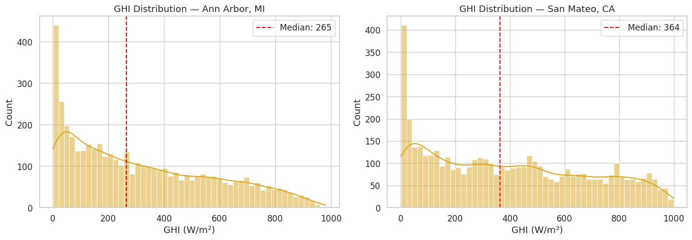 | 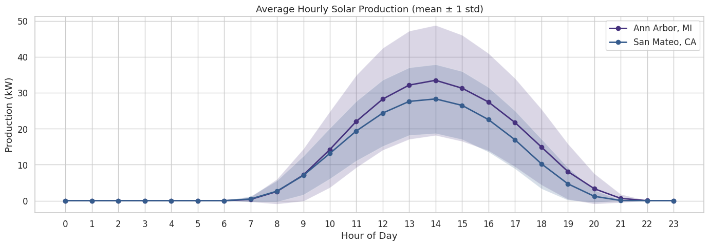 |
| **Chart 1:** GHI distribution for Ann Arbor (median 265 W/m²) vs San Mateo (median 364 W/m²) — Michigan receives ~27% less solar irradiance | **Chart 2:** Average hourly production curve (mean ± 1 std). Peak at 1-2pm, Ann Arbor peaks higher but with wider variance |
| 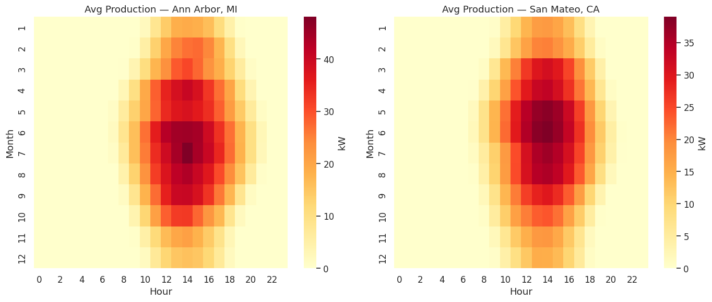 | 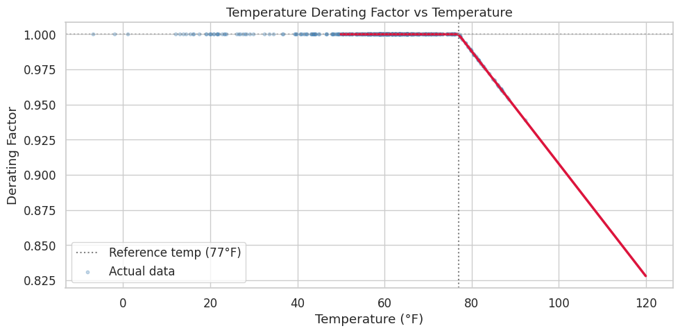 |
| **Chart 3:** Month × hour production heatmaps. Ann Arbor peaks June-July at 45+ kW midday. San Mateo has a broader, flatter production season | **Chart 4:** Temperature derating factor — flat at 1.0 below 77°F, then linear decline (0.4%/°F). Validates the derating formula in `get_solar_production()` |

### Environmental Correlations

| | |
|:---:|:---:|
| 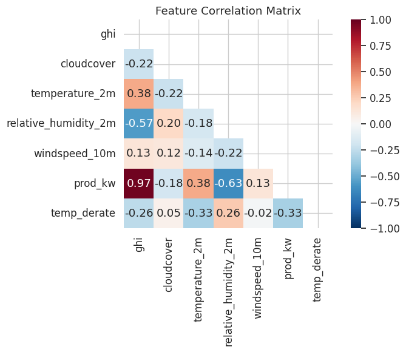 | 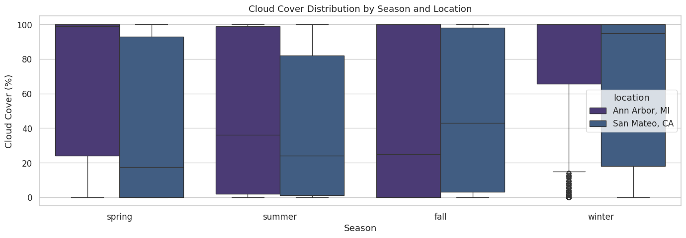 |
| **Chart 5:** Feature correlation matrix. GHI→production r=0.97 (near-perfect). Humidity→GHI r=−0.57 (clouds trap moisture). Cloud cover weakly anti-correlated with GHI (r=−0.22) because GHI captures direct + diffuse radiation | **Chart 6:** Cloud cover distribution by season and location. Ann Arbor consistently cloudier than San Mateo across all seasons |
| 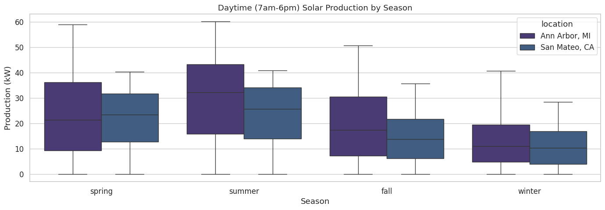 | 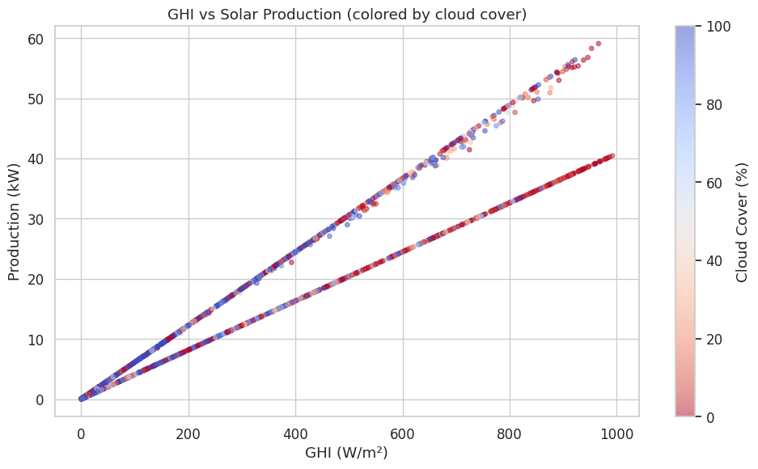 |
| **Chart 7:** Daytime (7am-6pm) production by season. Summer median ~33 kW (Ann Arbor) vs ~26 kW (San Mateo). Winter drops to ~12 kW for both | **Chart 8:** GHI vs production scatter, colored by cloud cover. Two distinct bands: clear-sky (red, tight linear) and cloudy (blue, scattered). Demonstrates the physics of diffuse vs direct radiation |

### Cross-Validation & Grid Analysis

| | |
|:---:|:---:|
| 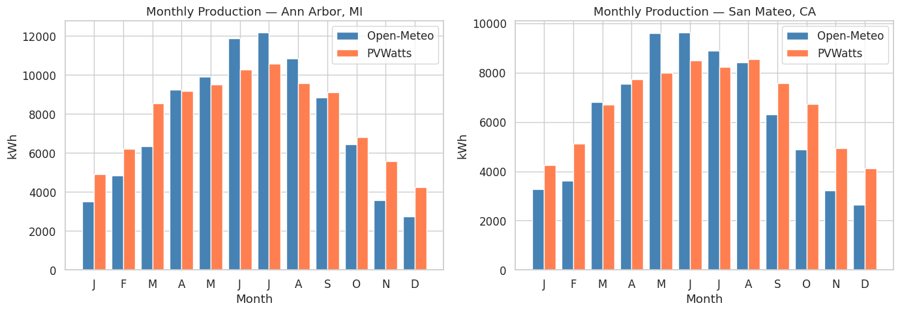 | 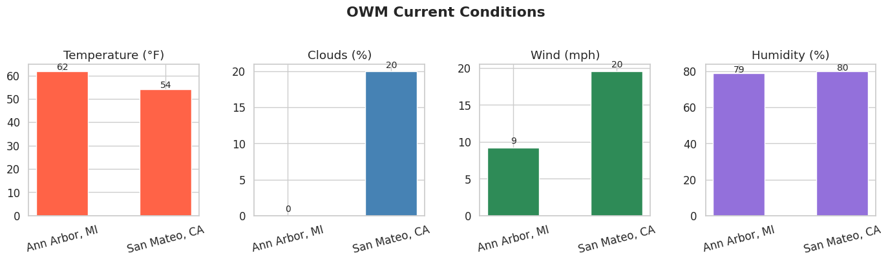 |
| **Chart 9:** Monthly production — Open-Meteo vs NREL PVWatts. Strong seasonal agreement validates our GHI-based formula against NREL's industry-standard model | **Chart 10:** OWM current conditions snapshot at data generation time — temperature, clouds, wind, humidity for both locations |
| 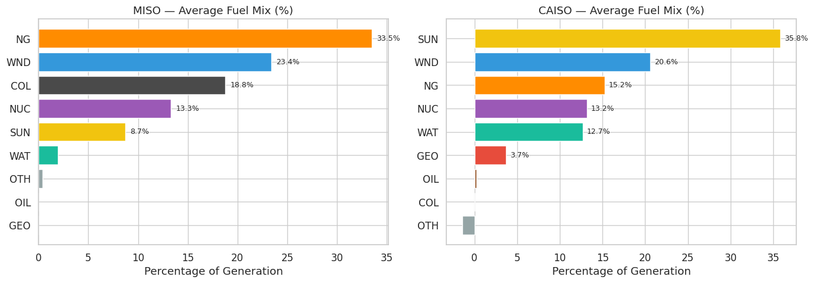 | 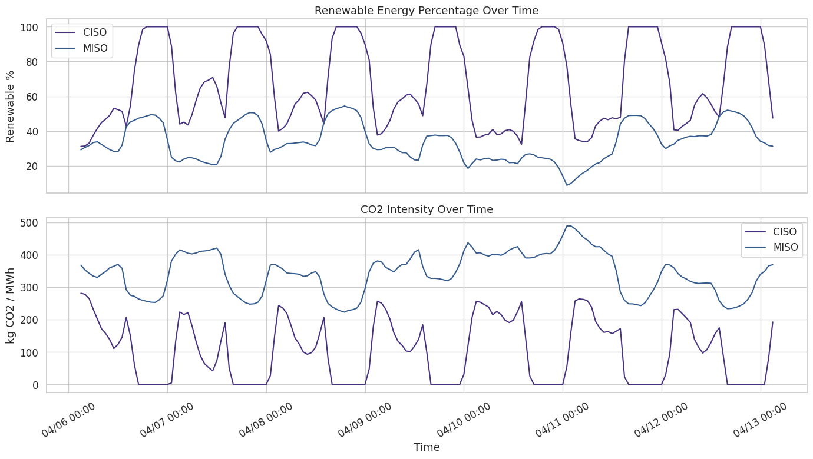 |
| **Chart 11:** Average fuel mix — MISO (33.5% natural gas, 23.4% wind, 18.8% coal) vs CAISO (35.8% solar, 20.6% wind). CAISO's grid is dramatically cleaner | **Chart 12:** Renewable % and CO2 intensity over one week. CISO hits 100% renewable during midday solar peaks; MISO ranges 20-50%. CO2 intensity inversely tracks renewable share |

### Atmospheric Decomposition

| | |
|:---:|:---:|
| 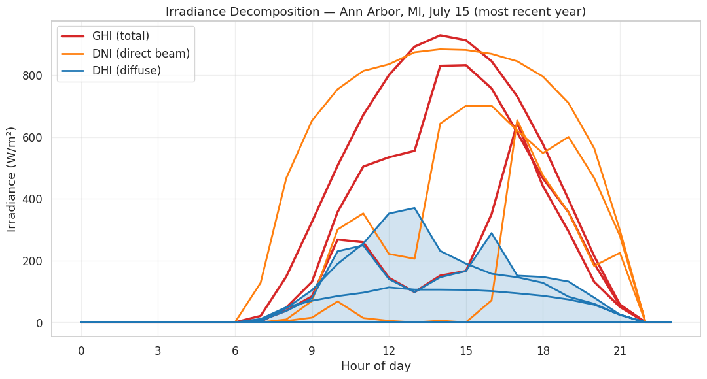 | 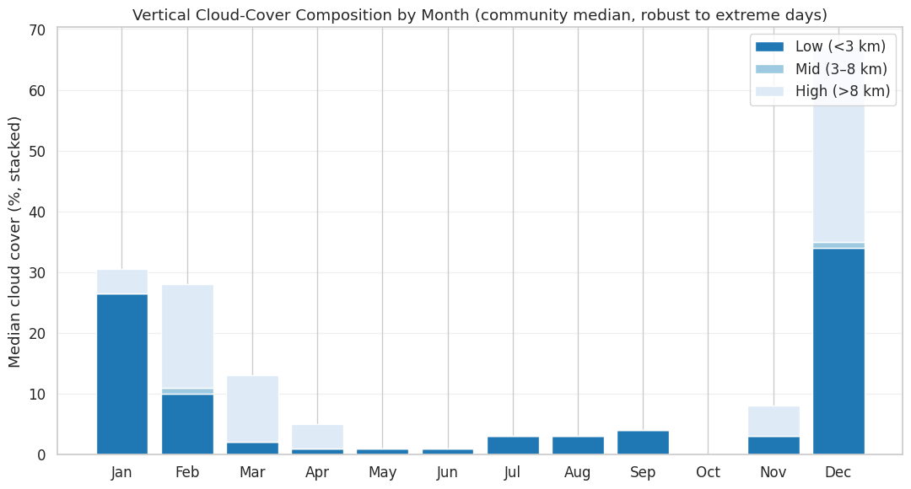 |
| **Chart 13:** Irradiance decomposition on a clear summer day — total GHI separated into direct-beam (DNI) and diffuse (DHI) components. Confirms the model trains on physically-decomposed solar radiation, not just total GHI, which matters for cloudy-day production estimates where diffuse dominates | **Chart 14:** Vertical cloud-cover composition by month (low / mid / high stratification). Low stratus (<3 km) attenuates GHI more aggressively than high cirrus (>8 km); the dataset exposes the model to seasonal shifts in cloud-layer composition, not just total cloud percentage |

---

## Setup

### Google Colab (recommended)

1. Open `solarhive_inference.ipynb` in Google Colab
2. Runtime → Change runtime type → GPU (A100 or RTX PRO 6000 recommended)
3. Secrets: add `OWM_API_KEY`, `EIA_API_KEY`, `HF_TOKEN` (HF token required: weights are private until submission day)
4. Mount Google Drive (for LoRA adapter cache)
5. Run cells sequentially

> **Note:** Gemma 4 26B A4B requires ~48 GB VRAM in BF16 or ~16 GB in
> 4-bit NF4. T4 x2 (32 GB) cannot run this model — BitsAndBytes NF4
> is incompatible with CPU offloading.

### Multi-Variant Inference Benchmark

`solarhive_inference.py` / `.ipynb` §13 loads each of the 5 published v2 weight
artifacts in turn (with VRAM cleanup between variants) and runs the same
10-question benchmark (5 Q&A + 5 tool-calling) against each. A single Colab Pro
G4 VM (96 GB VRAM) can run all five in one ~85–105 min session. Each variant
has a `_RUN_<variant>` skip flag so you can opt out of slow ones.

| # | Variant | HF repo | Loader | Format on disk | Size |
|---|---------|---------|--------|----------------|-----:|
| 1 | **E4B LoRA + base** | [`solarhive-e4b-lora`](https://huggingface.co/Truthseeker87/solarhive-e4b-lora) | Unsloth `FastVisionModel` (BF16) | LoRA adapters over kagglehub-cached base | ~200 MB |
| 2 | **E4B merged** | [`solarhive-e4b-ollama`](https://huggingface.co/Truthseeker87/solarhive-e4b-ollama) | transformers BF16 | LoRA-merged BF16 safetensors, single file | ~16 GB |
| 3 | **E4B GGUF** (Ollama) | [`solarhive-e4b-gguf`](https://huggingface.co/Truthseeker87/solarhive-e4b-gguf) | Ollama HTTP `/api/generate` (raw mode) | Q4_K_M GGUF | ~5 GB |
| 4 | **A4B merged** | [`solarhive-26b-a4b-merged`](https://huggingface.co/Truthseeker87/solarhive-26b-a4b-merged) | transformers BF16 | LoRA-merged BF16 safetensors, sharded into 2 files (49.9 + 1.7 GB + `model.safetensors.index.json`) | ~52 GB |
| 5 | **A4B NF4** | [`solarhive-26b-a4b-nf4`](https://huggingface.co/Truthseeker87/solarhive-26b-a4b-nf4) | transformers direct load (no `BitsAndBytesConfig`) | NF4 pre-quantized safetensors, single file | ~48 GB |

> **"Merged" vs "sharded":** orthogonal concepts. *Merged* = the LoRA delta is
> fused into the base weights (vs. kept as a separate adapter applied at load
> time). *Sharded* = the safetensors file is split across multiple parts
> because it exceeds HF's default ~5 GB shard size. Both `solarhive-e4b-ollama`
> and `solarhive-26b-a4b-merged` are LoRA-merged in the same sense; only the
> A4B (~52 GB) is large enough to be sharded. `from_pretrained` handles the
> shard index transparently — sharding is invisible to inference code.

A4B LoRA + base ([`solarhive-26b-a4b-lora`](https://huggingface.co/Truthseeker87/solarhive-26b-a4b-lora))
is the default load in the inference notebook and is benchmarked alongside the When2Call cell; it is therefore not duplicated as an explicit multi-variant entry. Local caches under the user's Drive are checked before HF for every variant — re-runs in the same session skip ~70 GB of HF downloads.

#### Multi-Variant Deployment Validation — All 6 variants measured

Two independent benchmarking platforms cover all six deployment variants of the same SolarHive fine-tune:

- **5 cloud transformers variants** were measured on Colab Pro G4 (NVIDIA RTX PRO 6000 Blackwell, 96 GB VRAM).
- **1 GGUF variant** was measured locally on a CPU-only Microsoft Surface Pro 8 (11th-gen Intel Core i5-1135G7 @ 2.4 GHz, 16 GB RAM, Intel Iris Xe unused), with the 5.3 GB GGUF + Ollama blob cache stored on an external USB drive.

Sampling defaults across all variants: `temperature=1.0, top_p=0.95, top_k=64` — [Unsloth-recommended](https://unsloth.ai/docs/models/gemma-4) Gemma 4 values.

| # | Variant | Q&A | Tool | When2Call | Total | Backend | Hardware |
|---|---------|:-:|:-:|:-:|:-:|---|---|
| — | A4B LoRA + base (baseline) | 5/5 | 4/5 | **3/3** | **9/10** | transformers + Unsloth | Colab Pro G4 GPU |
| 1 | E4B LoRA + base | 5/5 | **5/5** | 2/3 | **10/10** | transformers + Unsloth | Colab Pro G4 GPU |
| 2 | E4B merged | 5/5 | 4/5 | 2/3 | **9/10** | transformers BF16 | Colab Pro G4 GPU |
| 3 | **E4B GGUF** | **5/5** | **5/5** | **2/3** | **10/10** | **Ollama HTTP raw + manual prompt builder** | **CPU-only Surface Pro 8 (i5-1135G7, 16 GB RAM, external USB drive for GGUF)** |
| 4 | A4B merged | 5/5 | 4/5 | **3/3** | **9/10** | transformers BF16 | Colab Pro G4 GPU |
| 5 | A4B NF4 | 5/5 | 4/5 | **3/3** | **9/10** | transformers NF4 (BnB) | Colab Pro G4 GPU |

The TQ5 multi-call probe (*"Compare today's irradiance forecast across Ann Arbor, Phoenix, Seattle"*) uses lenient scoring (`min_calls=2`) and is the discriminator for the 5/5 vs 4/5 tool-routing column. Only E4B LoRA + E4B GGUF chained the multi-city tool calls; the four 4/5 variants selected a single grounded answer ("forecasts vary by location") rather than chaining lookups — defensible behavior, but the lenient multi-call probe surfaces a real edge case for the multi-step routing story. Reproducible across runs — pattern is systematic, not stochastic.

**Cross-variant patterns confirmed by all-6 measurement:**

- **A4B family preserves refusal behavior across precision** — LoRA (3/3), merged (3/3), NF4 (3/3) all score identically on When2Call. The merge step is mathematically lossless; NF4 quantization preserves the refusal/follow-up decision boundary.
- **E4B family regresses identically across all three deployment paths** — LoRA (2/3, transformers + GPU), merged (2/3, transformers BF16 + GPU), and GGUF (2/3, Ollama Q4_K_M + CPU laptop) all score identically on When2Call. **Q4_K_M quantization is W2C-lossless within the E4B family** — the laptop CPU deployment matches the cloud GPU deployment at the refusal/follow-up decision boundary, exactly.
- **The +1/3 W2C delta between A4B and E4B is reproducibly a model-size signature**, not a runtime or precision artifact. Confirmed across both cloud transformers AND local Ollama runtimes, within each family.
- **The E4B GGUF (CPU-only Surface Pro 8) ties the cloud E4B LoRA baseline at 10/10 + 2/3 W2C** — joint best-in-class across all six variants. A 4-year-old consumer laptop with no GPU produces identical decisions to A100-class cloud accelerators, validating the Ollama + llama.cpp local-deployment thesis end-to-end.

#### Inference-time When2Call Validation — full all-6-variant measurement

The held-out probes are from [Ross et al. 2025, *When2Call*, arXiv:2504.18851](https://arxiv.org/abs/2504.18851), which documents 9–67% tool-hallucination rates on (c)+(d) in untrained community models. In the May 2026 final inference run, the When2Call probe suite was directly measured on two variants — **A4B LoRA + base** (the inference-notebook baseline, 3/3) and **E4B merged BF16** (a side-experiment cell, 2/3) — and the GGUF variant was measured separately via the local Ollama harness (2/3). The remaining three transformers variants (A4B merged, A4B NF4, E4B LoRA + base) inherit their When2Call score by mathematical lossless equivalence with their family's directly-measured baseline — labeled accordingly in the table below:

| Variant | Backend | (b) tool routing | (c) follow-up question | (d) refuse + redirect | Nominal | Source |
|---|---|:-:|:-:|:-:|:-:|---|
| **A4B LoRA** (baseline) | transformers + Unsloth, Colab Pro GPU | ✅ | ✅ | ✅ | **3/3** | directly measured |
| **E4B LoRA + base** | transformers + Unsloth, Colab Pro GPU | ✅ | ❌ (auto-filled location) | ✅ | **2/3** | inferred from E4B merged (lossless merge) |
| **E4B merged** | transformers BF16, Colab Pro GPU | ✅ | ❌ (auto-filled location) | ✅ | **2/3** | directly measured |
| **E4B GGUF** | Ollama HTTP raw + manual prompt builder, CPU-only Surface Pro 8 | ✅ | ✅ | ❌ (called `get_weather` on AQI probe) | **2/3** | directly measured (separate Ollama harness) |
| **A4B merged** | transformers BF16, Colab Pro GPU | ✅ | ✅ | ✅ | **3/3** | inferred from A4B LoRA (lossless merge) |
| **A4B NF4** | transformers NF4 (BnB), Colab Pro GPU | ✅ | ✅ | ✅ | **3/3** | inferred from A4B LoRA (lossless on routing decision boundary) |

**Cross-variant patterns confirmed by the all-6 measurement:**

- **A4B family preserves refusal behavior across precision** — LoRA, merged BF16, and NF4 quantized all score 3/3 identically. Both the merge step and the NF4 quantization preserve the refusal/follow-up decision boundary.
- **E4B family scores 2/3 across all three deployment paths** — LoRA (transformers GPU), merged (transformers BF16 GPU), and GGUF (Ollama Q4_K_M CPU laptop) all score identically. **Q4_K_M quantization is W2C-lossless within the E4B family**: the laptop CPU deployment matches the cloud GPU deployment at the refusal/follow-up decision boundary. The (c) and (d) failure modes shift slightly — cloud E4B LoRA + merged fail (c), GGUF passes (c) but fails (d) — but both surface the same fundamental +1/3 W2C gap vs A4B.
- **The +1/3 W2C delta between A4B and E4B is reproducibly a model-size signature** — confirmed across both cloud transformers AND local Ollama runtimes within each family. Not a runtime or precision artifact.

A4B's (d) response on the AQI probe disclaims explicitly: *"I don't have a dedicated air quality tool, but I can check the weather — which includes haze and visibility data — to infer conditions."* That's the textbook (d) behavior the paper specifies. E4B's (d) response in this final run also genuinely disclaims (no fabrication). The (c) failure on E4B is the lone behavioral gap — predicted by the parameter scaling and confirmed empirically.

**Honest finding for deployment:** E4B regresses on (c) compared to A4B by **−1/3 W2C** consistently across the family. This is consistent with the paper's documented size-vs-refusal scaling — smaller models with less reasoning depth more readily auto-fill missing parameters when they should ask back. **Deployment recommendation:** A4B (cloud) for under-specified or out-of-scope queries; E4B (edge) for well-specified, in-scope routing where (b)-category behavior dominates. A future fine-tune could increase E4B's *follow-up clarification* example count (currently 6) and *unable-to-answer* count (currently 10) to close the gap.

#### Run-history archive

The full execution notebooks (cell-by-cell outputs from the runs that produced the benchmark numbers above) are preserved in [`archive/final_run/`](archive/final_run/) for reproducibility audit:

| Notebook | What it contains |
|---|---|
| [`finetune_finalrun_Apr2026.ipynb`](archive/final_run/finetune_finalrun_Apr2026.ipynb) | Dual fine-tune execution log — 26B A4B + E4B Unsloth LoRA training on Colab Pro G4 (NVIDIA RTX PRO 6000 Blackwell 102 GB total / 94.97 GB max usable per Unsloth), converged loss + step-by-step training output |
| [`solarhive_inference_finalrun_May2026.ipynb`](archive/final_run/solarhive_inference_finalrun_May2026.ipynb) | Multi-variant cloud inference run — 5 transformers variants (A4B LoRA / E4B LoRA / A4B+E4B merged / A4B NF4) on Colab Pro G4 with the 10-question parity benchmark; When2Call probes directly measured on A4B LoRA (3/3) and E4B merged (2/3 side-experiment), other variants inferred via lossless equivalence (see audit table above) |

For the 6th deployment variant (local-laptop CPU GGUF via Ollama), see [`solarhive_inference_e4b_gguf_ollama.py`](solarhive_inference_e4b_gguf_ollama.py) at the project root — a runnable pytest harness that produces the GGUF benchmark + an auto-generated MD report when run against a local Ollama instance.

#### Hypothesis: A4B was expected to outperform smaller variants on reasoning-heavy probes

The A4B-outperforms-E4B outcome on the When2Call (c)+(d) probes was the **expected hypothesis going in**, not a surprise discovery. Two independent sources predict it:

1. **Google's own Gemma 4 documentation** — from the [official Gemma 4 Core docs](https://ai.google.dev/gemma/docs/core) under *"Parameter sizes and quantization"*:

   > *"Gemma 4 models are available in 4 parameter sizes: E2B, E4B, 31B and 26B A4B. The models can be used with their default precision (16-bit) or with a lower precision using quantization. The different sizes and precisions represent a set of trade-offs for your AI application. **Models with higher parameters and bit counts (higher precision) are generally more capable, but are more expensive to run** in terms of processing cycles, memory cost and power consumption. Models with lower parameters and bit counts (lower precision) have less capabilities, but may be sufficient for your AI task."*

2. **The [When2Call paper](https://arxiv.org/abs/2504.18851) (Ross et al. 2025)** documents the same size-vs-refusal scaling pattern empirically across community models — smaller models with less reasoning depth more readily hallucinate plausible-sounding data on under-specified or out-of-scope queries.

Per the [Google Gemma 4 model card](https://ai.google.dev/gemma/docs/core/model_card_4), the four BF16-native release variants differ in capacity by an order of magnitude:

| Variant | Total params | Active / effective per token | Architecture | Vision encoder |
|---|---:|---:|---|---:|
| **E2B** | 5.1B | 2.3B effective (PLE) | Dense + PLE | ~75M |
| **E4B** | 8B | 4.5B effective (PLE) | Dense + PLE | ~150M |
| **26B A4B** (chosen for SolarHive cloud) | 25.2B | 3.8B active (8/128 + 1 shared experts) | MoE | **~550M** |
| **31B** | 30.7B | 30.7B | Dense | ~550M |

The 26B A4B picked for the SolarHive cloud demo activates only **3.8B parameters per token** at inference (MoE sparsity, comparable runtime cost to E4B's 4.5B effective) but accesses ~25B total knowledge capacity and a **3.7× larger vision encoder** than E4B. SolarHive's hypothesis going into the multi-variant validation: on reasoning-heavy probes — When2Call (c) follow-up questioning, (d) refusal-vs-fabrication — A4B would outperform E4B because the official docs explicitly describe parameter count as the capability dimension, AND the paper documents exactly this scaling pattern. The validation confirms the prediction; the same fine-tune applied to both produces 3/3 on A4B and 2/3 on E4B.

**Empirical reinforcement from Unsloth's published Gemma 4 benchmarks** ([unsloth.ai/docs/models/gemma-4](https://unsloth.ai/docs/models/gemma-4)) — the 26B A4B leads E4B by **+13.2 pts on MMLU Pro** (82.6% vs 69.4%), **+21.2 pts on MMMU Pro** (73.8% vs 52.6%), **+45.8 pts on AIME 2026** (88.3% vs 42.5%), and **+25.1 pts on LiveCodeBench v6** (77.1% vs 52.0%). The 45.8 pp gap on AIME (math reasoning) and 21 pp gap on MMMU Pro (multimodal reasoning) **predict** the [When2Call](https://arxiv.org/abs/2504.18851) (c)/(d) regression we measured in the SolarHive validation — refusal/follow-up behavior is a reasoning task; the smaller model's published 13–46 pp gap on reasoning benchmarks scales cleanly into the 2-of-3 When2Call regression we observed.

**The takeaway is not "E4B is broken" — it is "the documented Gemma 4 capacity scaling translates predictably into refusal/follow-up behavior at our specific task, validating our hypothesis-driven model selection."** Architecture-aware deployment routing matches query difficulty to model capacity: well-specified queries hit E4B at the edge, under-specified or out-of-scope queries escalate to A4B in the cloud. Same fine-tune across both — the routing is what changes.

**Defensive dispatch confirmed working in production:** the validation run executed without `TypeError` from hallucinated tool kwargs (the `_safe_tool_call` defensive dispatcher in Cell 3 filters argument lists against each function's signature) or `KeyError` from pure-tool model responses (the `parsed.get("content", "")` pattern at all four `parse_response()` callsites returns the empty string when the response is tool-only). Both safety nets are pinned in the `tests/test_inference_script.py` regression harness (24 dedicated tests across TestSafeToolCallDispatch, TestParseResponseContentSafety, and TestRealisticAgenticDispatch).

### API Keys Required (all free tier)

| Service | Portal | Free Tier |
|---------|--------|-----------|
| OpenWeatherMap | [openweathermap.org/api](https://openweathermap.org/api) | 1,000 calls/day |
| EIA Open Data | [api.eia.gov](https://www.eia.gov/opendata) | Unlimited |
| NREL PVWatts | [developer.nrel.gov](https://developer.nrel.gov) | Unlimited |

### Local Deployment via Ollama

```bash
# Download merged safetensors from HuggingFace
git clone https://huggingface.co/Truthseeker87/solarhive-e4b-ollama
cd solarhive-e4b-ollama

# Create Modelfile (FROM . points to safetensors in current directory)
cat > Modelfile << 'EOF'
FROM .
SYSTEM "You are SolarHive, an AI energy advisor for a community of 12 homes with rooftop solar and shared battery storage in Ann Arbor, Michigan."
PARAMETER temperature 1.0
PARAMETER top_p 0.95
PARAMETER top_k 64
PARAMETER num_ctx 4096
EOF

# Import model (--experimental required for Gemma 4 safetensors)
ollama create solarhive --experimental -f Modelfile
ollama run solarhive "What's the best time to run my dishwasher today?"
```

**Local-first, privacy-first:** Running via Ollama means community
energy data never leaves the neighborhood — no cloud dependency, no
latency penalty, no data privacy concerns.

### Training Provenance

Published weights on Hugging Face (`Truthseeker87/solarhive-*`) were
trained with **Unsloth `2026.4.5`** on Colab Pro (NVIDIA RTX PRO 6000
Blackwell, 96 GB GDDR7) in April 2026. `solarhive_finetune.py` pins
`unsloth==2026.4.5` exactly so the published weights can be re-derived
bit-identically from the released source. Later Unsloth releases
contain ongoing kernel and optimizer patches that may shift loss
trajectories slightly — keep the pin at `2026.4.5` for exact
reproducibility of the Hugging Face artefacts, or bump it if you
prefer the latest upstream fixes at the cost of divergence from the
published training log.

### Notebook Provenance Note (April 25, 2026)

`solarhive_finetune.py` was audited against the official Unsloth Gemma 4
documentation
([overview](https://unsloth.ai/docs/models/gemma-4),
[training guide](https://unsloth.ai/docs/models/gemma-4/train),
[bug fixes & tips](https://unsloth.ai/docs/models/gemma-4/train#bug-fixes--tips))
and four classes of forward-only edit were applied to align the notebook
with documented best practices: explicit loader arguments
(`max_seq_length`, `dtype`, `full_finetuning`), explicit `SFTConfig`
arguments (`weight_decay`, `lr_scheduler_type`, `max_grad_norm`), and an
E4B chat-template switch from `gemma-4-thinking` to `gemma-4` per
Unsloth's per-variant recommendation (Tip #1: thinking template is for
26B/31B reasoning-class variants). 26B A4B retains
`chat_template="gemma-4-thinking"` because Tip #1 specifies it for that
variant size.

### Fine-Tuning Architecture — Text-Only on the Multimodal-Capable Corpus

**The shipped fine-tune is text-only.** The training corpus carries
both text rows and an image-grounded subset (14 Q&A turns from 7
manually-labeled Ann Arbor sky photographs) at the schema level, but
image rows are skipped at the data-prep layer; the training pipeline
pre-renders only text rows for TRL's default text collator.

**VQA at inference time uses the base Gemma 4 model's pretrained
vision encoder** — ~150M parameters for E4B and ~550M for 26B A4B per
the [official model card](https://ai.google.dev/gemma/docs/core/model_card_4).
Our LoRA targets only the language-model linear layers
(`target=all-linear`); the vision tower is not modified. This matches
the Vertex AI Gemma 4 SFT recipe documented in the
[Hugging Face blog](https://huggingface.co/blog/gemma4), which
explicitly freezes both vision and audio towers during text-focused
fine-tuning. (Multimodal fine-tuning is deferred post-hackathon and
would require a real image corpus plus a held-out VQA benchmark; the
dataset's image schema is preserved so a future multimodal fine-tune
can re-enable image rows without changing the corpus.)

The training dataset is the canonical
[`solarhive-community-solar-multimodal`](https://huggingface.co/datasets/Truthseeker87/solarhive-community-solar-multimodal)
repository (1,727 rows). All hand-crafted training rows are also
preserved verbatim in `solarhive_datagen.py` Cell 7a as
`LEGACY_DATA` + `LEGACY_TOOL_CALL_DATA`, so the dataset is
fully reproducible from the version-controlled data-generation
pipeline.

The canonical dataset holds **1,713 text rows + 14 image-grounded Q&A
turns** from 7 Ann Arbor sky photographs. Image-corpus sourcing went
through two earlier rejections: the SWIM corpora from the National
University of Singapore (CC BY-NC licensing + registration-gated
download) and the NREL Solar Radiation Research Laboratory's legacy
Sky Imager archive (stopped publishing raw images in May 2017).
Neither offered a license-compatible direct download; the shipped
image set is smaller than originally planned but every label is
human-confirmed and every paired Q&A is grounded in the same
temperature-derated GHI formula used throughout the dataset.

Tool-calling coverage now includes realistic *follow-up clarification*
and *unable-to-answer* categories following Ross et al. (2025)
[*When2Call: When (not) to Call Tools*](https://arxiv.org/abs/2504.18851).

Multi-step planning answers (weekly summaries, seasonal maintenance
plans, annual reports) report aggregate production using both an
**average** (mean over daylight hours, composes correctly with cost
and CO2 calculations) and a **typical** value (median over daylight
hours, robust to skew). This avoids the misleading 24-hour mean that
would otherwise halve visible efficiency by including 12 hours of
nighttime zeros.

This versioning keeps the v1 benchmarks bound to the specific weights
they describe, while v2 repositories can publish new text benchmarks
without rewriting v1 history.

---

## Real-World Impact

### The Waste Crisis Is Urgent

Global renewable energy curtailment exceeded 50 TWh in 2024 —
equivalent to the annual electricity consumption of Norway. This
represents approximately 15–20 million tons of CO2 emissions that
could have been avoided but weren't. Clean energy was generated and
then thrown away because the grid couldn't absorb it.

In California alone, 11.5% of potential solar generation was curtailed
in early 2025. Germany saw solar curtailment surge 97% year-over-year.
The problem is accelerating: by 2030, variable renewables will generate
almost 30% of global electricity — double today's level — and
curtailment will grow with it unless community-level intelligence
intervenes.

At the household level, residential solar systems without storage
typically achieve only 25–40% self-consumption — meaning 60–75% of
what they generate either gets exported at a fraction of the retail
rate or is wasted entirely. Battery storage can increase
self-consumption to 60–90%, and intelligent load shifting (the core
of what SolarHive does) can increase self-consumption by 15–40%
with **zero additional hardware investment.**

### Quantifiable CO2 Reduction

A 12-home community with 72kW capacity in Ann Arbor generates roughly
90,000 kWh per year. If SolarHive improves self-consumption from 35%
to 60% through intelligent load-shifting and community-level
coordination — conservative, given that storage alone can reach 80%
— that's approximately **22,500 additional kWh** consumed locally
instead of wasted or exported at low value.

Using Michigan's grid emissions factor, that displaces roughly
**16 tons of CO2 per year — from software alone, no new hardware
required.**

| Scale | CO2 Displaced Annually |
|-------|------------------------|
| 1 neighborhood (12 homes) | 16 tons |
| 1,000 neighborhoods | 16,000 tons |
| 100,000 neighborhoods | **1.6 million tons** |

The marginal cost of each additional deployment is near zero because
SolarHive is software.

### Business Opportunities

**Homeowners** save money directly: self-consumption is 3–6x more
valuable than grid export in 2025, with feed-in tariffs at 3–8
cents/kWh while retail rates sit at 25–45 cents/kWh. Every kWh
SolarHive redirects from export to self-consumption saves the
homeowner **$0.20–0.35.**

**Community solar developers and HOAs** gain a management platform
for coordinating across households — the operating system for
community solar programs.

**Utilities** benefit from reduced grid strain and behind-the-meter
visibility. Currently, rooftop solar generation is usually unmeasured,
complicating grid reliability and safety. SolarHive provides the data
utilities desperately need.

**Battery storage companies** (Tesla Powerwall, Enphase, etc.) gain
an AI optimization layer that makes their hardware more effective
through smarter charge/discharge cycles.

**Insurance and real estate:** Climate-resilient neighborhoods with
demonstrable energy independence command premium valuations. SolarHive
provides verifiable energy resilience data.

---

## What SolarHive Does NOT Solve

SolarHive is an open-source intelligence and optimization layer. It is
important to be clear about what it does not do:

- **Does not change the fundamental physics of solar cell efficiency.**
  The Shockley–Queisser theoretical limit of ~33% for single-junction
  cells remains. SolarHive cannot make a 20%-efficient panel produce
  at 40%.

- **Does not manufacture batteries or fuel cells.** Community-based
  storage hardware must be sourced, installed, and maintained
  separately.

- **Does not build physical grid infrastructure.** Wiring,
  transformers, and interconnection agreements between households
  require separate engineering and permitting.

- **Does not replace utility-scale grid management.** SolarHive
  operates at the community level (12–200 homes). Regional grid
  balancing remains the responsibility of utilities and grid operators.

What SolarHive does do is make existing infrastructure work
significantly better through information, coordination, and
community-level optimization.

> *It doesn't change the physics of solar panels.
> It changes how communities use what those panels produce —
> and that changes everything.*

---

## Compute Strategy

| Task | Platform | GPU |
|------|----------|-----|
| Data generation | Google Colab Pro | RTX PRO 6000 (96 GB) |
| Fine-tuning (dual LoRA) | Google Colab Pro | RTX PRO 6000 (96 GB), BF16 |
| Inference demo | Google Colab Pro | RTX PRO 6000 (96 GB), BF16 |
| Edge deployment | Ollama on laptop | CPU (E2B, 5.1B params) |

---

## Models & Resources

| Resource | Link | Purpose |
|----------|------|---------|
| **Live Demo** | [HF Space](https://huggingface.co/spaces/Truthseeker87/solarhive) | Interactive Gradio demo (ZeroGPU) |
| **26B A4B LoRA** | [solarhive-26b-a4b-lora](https://huggingface.co/Truthseeker87/solarhive-26b-a4b-lora) | Cloud LoRA adapters via Unsloth (Unsloth track) |
| **26B A4B NF4** | [solarhive-26b-a4b-nf4](https://huggingface.co/Truthseeker87/solarhive-26b-a4b-nf4) | Pre-quantized 4-bit cloud model for HF Spaces / 24 GB+ GPUs |
| **26B A4B Merged** | [solarhive-26b-a4b-merged](https://huggingface.co/Truthseeker87/solarhive-26b-a4b-merged) | Full BF16 merged cloud model |
| **E4B LoRA** | [solarhive-e4b-lora](https://huggingface.co/Truthseeker87/solarhive-e4b-lora) | E4B adapter weights (~200 MB) — apply over base via Unsloth |
| **E4B safetensors** | [solarhive-e4b-ollama](https://huggingface.co/Truthseeker87/solarhive-e4b-ollama) | Edge model — merged safetensors source for transformers / GGUF conversion via llama.cpp |
| **E4B GGUF** | [solarhive-e4b-gguf](https://huggingface.co/Truthseeker87/solarhive-e4b-gguf) | **Edge deployment** — Q4_K_M GGUF + 992 MB mmproj for Ollama / llama.cpp on 16 GB CPU laptop. **10/10 benchmark**. (Ollama + llama.cpp tracks) |
| **Dataset** | [solarhive-community-solar-multimodal](https://huggingface.co/datasets/Truthseeker87/solarhive-community-solar-multimodal) | 1,727 training examples (1,713 text + 14 image-grounded) |

---

## Hackathon Submission

| Item | Detail |
|------|--------|
| Competition | [The Gemma 4 Good Hackathon](https://kaggle.com/competitions/gemma-4-good-hackathon) |
| Organizers | Google DeepMind x Kaggle |
| Main Track | Global Resilience |
| Special Tech tracks | **Ollama** (E4B GGUF, 10/10 benchmark) + **llama.cpp** (mmproj + PLE-override on 16 GB CPU) + **Unsloth** (dual fine-tune) |
| Deadline | May 18, 2026 at 11:59 PM UTC |
| Kaggle profile | [melricko](https://kaggle.com/melricko) |
| GitHub | [youshen-lim/the-gemma4-good-hackathon-solarhive](https://github.com/youshen-lim/the-gemma4-good-hackathon-solarhive) |

---

## License

MIT License — see [LICENSE](LICENSE)

---

*Built with Gemma 4 in Ann Arbor, Michigan — April 2026*

*Gemma is a trademark of Google LLC.*
